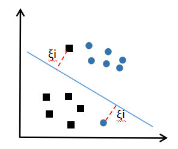

# 数据预处理
[toc]
## 数据清洗
1. 缺失值、异常值处理  
    - 删除缺失值  
    - 均值、众数、中位数填充
    - 删除异常值（箱线图确定异常值）

## 数据转换
1. 分类数据和数值数据  
    **分类数据**分为 **有序数据** 和 **名称性数据**。
    **数值数据**分为 **离散数据** 和 **连续数据**。  
2. 分类数据处理  
    分类数据面临的挑战：
    - 删除缺失值  

 3. 方法
    数值型数据：标准缩放：
    - 归一化：将数据范围缩放到（默认）0-1之间。
    - 标准化：均值为0，标准差为1的分布  
    - 缺失值处理 

    分类型数据
    - one-hot编码
    
    时间类型
    - 时间的切分
   


one-hot编码

# 机器学习
## 类型
**监督学习**：（1）分类问题；（2）回归问题（一个或多个变量预测一个结果变量）；（3）时间序列分析。
**无监督学习**：（1）聚类分析；（2）关联分析。
**强化学习**。
   
##  性能指标 
1. 混淆矩阵


2. 指标计算
* **精确度（误报）**
    $$精确度 = \dfrac{真阳性}{真阳性+假阳性} =\dfrac {真阳性}{预测的阳性合计}$$
    $$precision = \dfrac{TP}{TP+FP} =\dfrac {TP}{predictPositive}$$
    
* **召回率（查全率，漏报**）
    $$召回率 = \dfrac{真阳性}{真阳性+假阴性} =\dfrac {真阳性}{实际的阳性合计}$$
    $$recall = \dfrac{TP}{TP+FN} =\dfrac {TP}{allPositive}$$
    
* **准确率**
    $$准确率 = \dfrac{所有预测正确的结果数量}{预测的结果总计} $$
    $$accuracy = \dfrac{TP+TN}{FN+TP+FP+TN} $$

* **F1分数**
    $$F1分数 = \dfrac{2*精确度*召回率}{精确度+召回率} $$
    
    $$F1score = \dfrac{2*accuracy*recall}{accuracy+recall} $$
    F1分数运行在accuracy和recall之间实现平衡。

* **偏差**：预测值与实际值之间的距离。（高偏差意味着模型过于简单）
* **方差**：预测值离散程度。（高方差意味着过拟合）

# 基于Scikit-Learn库的机器学习
## 简单线性回归
* 模型：$y=a+bx$，a为截距，b为斜率。基于**一个**自变量预测因变量。

* 模型评估指标：
    （1）**绘制散点图**
    （2）**Pearson系数（皮尔逊系数）**
    
    公式：    $r_{xy}  = \dfrac{n\sum x_iy_i - \sum x_i\sum _iy}{\sqrt{n\sum x_i^2-(\sum x_i)^2}\sqrt{n\sum y_i^2 - (\sum y_i)^2}}$
    相关库：
    ```
    # numpy库
    import numport as np
    pccs = np.corrcoef(y_test, y_prediction) # 皮尔逊相关系数
    
    # scipy库
    from scipy.stats import pearsonr
    pccs = pearsonr(y_test, y_prediction) # 皮尔逊相关系数
    ```
    系数阈值说明：系数的取值总是在-1.0到1.0之间，接近0的变量被成为无相关性，接近1或者-1被称为具有强相关性。
    
  （3） 残差分布图
    数据拟合非常好的模型具有正态分布的残差。
    可以使用使用shapiro对残差进行假设检验。当p值>0.05(5%)时，可以认为该分布服从正态分布。
    ```
    from scipy.stats import shapiro
    shapiro_p_value = shapiro(y_test-y_prediction)
    W = shapiro_p_value[0] # 检验统计量
    p = shapiro_p_value[1] # p值，p-value 用于假设检验，5%
    ```
  （4）计算平均绝对误差、均方误差、均方根差和拟合度
    ```
    from sklearn import metrics
    import numpy as np
    metrics_df = pd.DataFrame({'Metric': ['MAE',
                                        'MSE',
                                        'RMSE',
                                        'R-Squared'],
                            'Value':[metrics.mean_absolute_error(y_test, y_prediction), # 平均绝对误差
                                        metrics.mean_squared_error(y_test, y_prediction), # 均方误差
                                        np.sqrt(metrics.mean_squared_error(y_test, y_prediction)),  # 均方根差
                                        metrics.explained_variance_score(y_test, y_prediction)]})  # 拟合度
    print(metrics_df)
    ```
    数值说明：
    （1）MAE（平均绝对误差）：预测值和实际值之间的平均绝对差。
    （2）MSE（均方误差）：预测值与实际值之间平方差的均值。
    （3）RMSE（均方根差）：MSE的平方根。
    （4）R-Squared（拟合度）：反映线性回归方程能够解释的因变量中的方差之比。即自变量解释了因变量变化的R-Squared值。

## 多元线性回归
* 模型：$y=a+b_1x_{i1}+b_2x_{i2}+···+b_{p-1}x_{i,p-1}$，a为截距，b为每个特征x的斜率。基于**多个**自变量预测因变量。
* 模型评估指标：与简单线性回归相同。

## 逻辑回归
* 模型：逻辑回归使用分类变量和连续变量来预测分类结果（对分类因变量进行回归分析）。
             当预测二元结果时，特征值和结果值之间不存在线性关系，线性回归的假设不成立。此外 ，为了以线性方式表                  达非线性关系，必须使用**对数变换**来转换数据。因此，逻辑回归能使模型在给定特征的情况下预测二进制结果出现的概率。
             具有一个预测变量的逻辑回归方程：$P(Y)=\dfrac{1}{1+e^{-(a+bx)}}$，a为截距，b为特征x的斜率。
              具有多个预测变量的逻辑回归方程：$P(Y)=\dfrac{1}{1+e^{-(a+b_1x_{i1}+b_2x_{i2}+···++b_{p-1}x_{ip-1})}}$，a为截距，b为每个特征x的斜率。

* 特点：线性回归中，假设预测变量与结果变量之间存在线性关系。逻辑回归中，假设预测变量与$\dfrac{p}{1-p}$的自然对数之间存在线性关系，其中p是事件发生的概率。

* 系数的解释
   假设逻辑回归模型中，特征B的系数为b，则表示B每增加1个单位，结果的对数概率增加b。
   
* 模型评估和指标计算
    ```
    from sklearn.linear_model import LogisticRegression
    logistic_model = LogisticRegression()
    logistic_model.fit(X_train, y_train)
    intercept = logistic_model.intercept_[0]
    coeffient_list = logistic_model.coef_[0]
    cof_df = pd.DataFrame({'Feature':X.columns,
                       'cof_':coeffient_list})                  
    #print(cof_df)
    
    #预测概率
    y_predict_prob = logistic_model.predict_proba(X_test)[:,1]
    
    #预测类别
    y_predict = logistic_model.predict(X_test)
    
    # 使用混淆矩阵评估
    from sklearn.metrics import confusion_matrix
    import numpy as np
    c_matrix = confusion_matrix(y_test, y_predict, labels=[0,1]) # labels参数用于控制输出的顺序
    cm_df = pd.DataFrame(c_matrix)
    cm_df['Total'] = np.sum(cm_df, axis=1)
    cm_df = cm_df.append(np.sum(cm_df, axis=0), ignore_index=True)
    cm_df.columns = ['Predict_0', 'Predict_1', 'Total']
    cm_df = cm_df.set_index([['Actual_0', 'Actual_1', 'Total']])
    print(cm_df)
    ```
    生产分类报告
    ```
    from sklearn.metrics import classification_report
    print(classification_report(y_test, y_predict))
    ```
    
* 使用超参数（网格化）
 逻辑回归可以通过调整超参数，为每个超参数组合拟合模型，并确定最优模型中的超参数组合。
 例：计算最高的F1 score
```
# 使用超参数
print(logistic_model)
grid = {'penalty': ['l1', 'l2'],
        'C': np.linspace(1, 10, 10),
        'solver': ['warn', 'liblinear']}
# 寻找F-1分数最高的参数
from sklearn.model_selection import GridSearchCV
from sklearn.linear_model import LogisticRegression
grid_model = GridSearchCV(LogisticRegression(solver='liblinear'), grid, scoring='f1', cv=5)
grid_model.fit(X_train, y_train)
best_value = grid_model.best_params_
print(best_value)
```

## 支持向量机（SVM）
* 简介
支持向量机（SVM）用于监督学习，解决分类和回归问题。最长用于分类问题。
* 其他概念
例（本例中的观测数据为线性可分）：
***support vector（支持向量）：使每个分类中最接近MMH的点来表示MMH，这些点称为支持向量，且每个分类中至少包含一个。**
 


    实际上，大多数数据是线性不可分的，相对于线性可分数据的最大间隔超平面，此时SVM通过松弛变量来创建软间隔（soft margin），允许某些观测值落入不正确的一测。
    
    如上图，两个观测值落入不正确的一侧。
    1. 如果用一个成本值代表分类错误的数据点，则SVM总是寻求成本最小化，而非追求最大间隔。确定合适的成本参数最重要：（1）随着成本参数增加，要实现100%的分离，SVM优化会更难，且可能导致过拟合。（2）相反，较低的成本参数将使表面边界更宽，且可能无法拟合数据。
    2. 通过使用核技巧（kernel trick），可以将非线性分离数据转换到一个高维空间上，此时非线性关系可能呈现出线性关系。通过原始数据转换，SVM可以发现原始特征中显示不明确的关联。
    3. 为了实现SVM分类器模型效率最大化，必须确定核函数（**核函数用于升维，常见的有线性核、多项式核、S核**）和成本函数的最佳组合（**通常通过调整超参数方法**）。
    